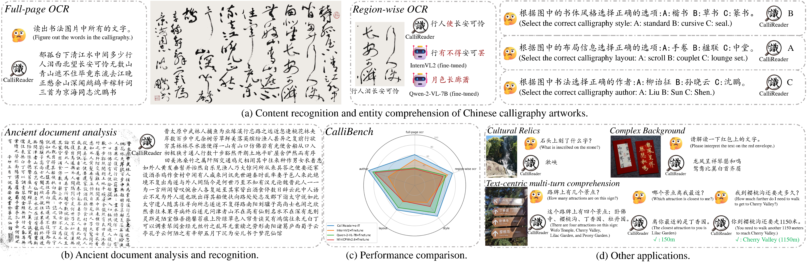

<h2 align="center">
  <b>CalliReader: Contextualizing Chinese Calligraphy via
an Embedding-aligned Vision Language Model</b>


<div align="center">
     <a href="https://arxiv.org/abs/2503.06472" target="_blank">
        
    </a>
    </a>
    <a href="your pdf here" target="_blank">
    </a>
</div>
</h2>

This is the repository of [**CalliReader: Contextualizing Chinese Calligraphy via
an Embedding-aligned Vision Language Model**](https://arxiv.org/pdf/2503.06472).

CalliReader is a novel plug-and-play Vision-Language Model (VLM) specifically designed to interpret calligraphic artworks with diverse styles and layouts, leveraging slicing priors, embedding alignment, and effective fine-tuning. It demonstrates remarkable performances on Chinese Calligraphy recognition and understanding, while also retains excellent OCR ability on general scenes.

For more information, please visit our [**project page**](https://your_page_here/).



## 📬 News
- **2025.2.12** The repository has been updated.

## How to Use Our Code and Model:
We are releasing our network and checkpoints. All plug-and-play modules can be downloaded [**here**](https://drive.google.com/file/d/1tZxMAACSEICF-lfEZRIFRnnP_Udw-TAU/view?usp=drive_link). You should put the folder ```params``` in the main directory. You can download weights of our CalliReader+e-IT from this and [**link**](https://huggingface.co/gtang666/CalliReader_eval/tree/main). Only files that end with ```.safetensors``` are required and should be put into the folder ```InternVL```.

You can setup the pipeline under the following guidance.

### 0. Install dependencies
1. We recommend creating a conda environment with Python>=3.9 and activate it:
```
conda create -n callireader python=3.9
conda activate callireader
```
2. Then, install essential dependencies:
```
pip install requirements.txt
```
3. Finally, install the package ```flash-attn```:
```
pip install flash-attn
```
If you encounter certain problems with this package, you can download .whl file [here](https://github.com/Dao-AILab/flash-attention/releases) for direct installation:
```
pip install flash_attn-xxx.whl
```
Please note that this package only supports Linux systems with CUDA installed, and all of their versions should be matched. For further issues about ```flash-attn```, please turn to its [repository](https://github.com/Dao-AILab/flash-attention) for help. 

### 1. Inference
We have verified that ```.jpg``` and ```.png``` format images are well supported.

1. For a single image, use
```
python inference.py --tgt=<image path> 
```
The result will be output directly in the terminal.

2. For a folder with multiple images, use
```
python inference.py --tgt=<folder path>  --save_name=<your save name>
```
Results will be saved to ```./results/<your save name>.json```.

## Citation
```
@article{luo2025callireader,
  title={CalliReader: Contextualizing Chinese Calligraphy via an Embedding-Aligned Vision-Language Model},
  author={Luo, Yuxuan and Tang, Jiaqi and Huang, Chenyi and Hao, Feiyang and Lian, Zhouhui},
  journal={arXiv preprint arXiv:2503.06472},
  year={2025}
}
```
