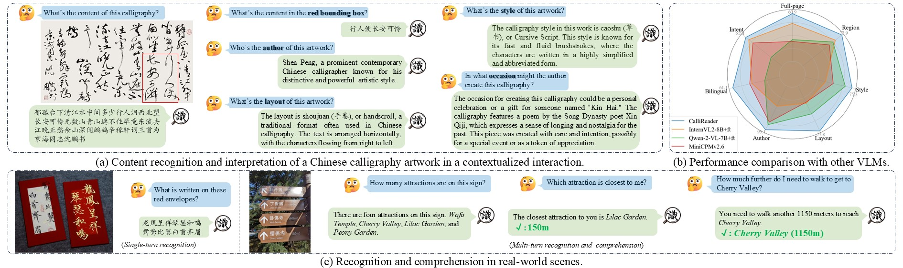

<h2 align="center">
  <b>CalliReader: Contextualizing Chinese Calligraphy via
an Embedding-aligned Vision Language Model</b>


<div align="center">
     <a href="https://arxiv.org/abs/2503.06472" target="_blank">
        
    </a>
    </a>
    <a href="your pdf here" target="_blank">
    </a>
    <a href="https://huggingface.co/datasets/gtang666/CalliBench" target="_blank">
        
    </a>
</div>
</h2>

This is the repository of [**CalliReader: Contextualizing Chinese Calligraphy via
an Embedding-aligned Vision Language Model**](https://arxiv.org/pdf/2503.06472).

CalliReader is a novel plug-and-play Vision-Language Model (VLM) specifically designed to interpret calligraphic artworks with diverse styles and layouts, leveraging slicing priors, embedding alignment, and effective fine-tuning. It demonstrates remarkable performances on Chinese Calligraphy recognition and understanding, while also retains excellent OCR ability on general scenes.

For more information, please visit our [**project page**](https://your_page_here/)    (Unfinished).



## 📬 News
- **2025.10.6** We are releasing our CalliBench.
- **2025.8.10** We are releasing our training scripts.
- **2025.6.26** Our newest model is now available on HuggingFace.
- **2025.6.25** Our work has been accepted by ICCV 2025!
- **2025.2.12** The repository has been updated.

## How to Use Our Code and Model:
We are releasing our network and checkpoints. You can download weights of our CalliReader from this [**HuggingFace  link**](https://huggingface.co/gtang666/CalliReader/tree/main). Finetuned VLM weight files that end with ```.safetensors``` are stored in the folder ```InternVL```, and all pluggable modules can be found in the folder ```params```. You can download those files and put them in the same folder of the cloned repository.

You can setup the pipeline under the following guidance.

### 0. Install dependencies
1. We recommend creating a conda environment with Python>=3.9 and activate it:
```
conda create -n callireader python=3.9
conda activate callireader
```
2. Then, install essential dependencies:
```
pip install requirements.txt
```
3. Finally, install the package ```flash-attn```:
```
pip install flash-attn
```
If you encounter certain problems with this package, you can download .whl file [here](https://github.com/Dao-AILab/flash-attention/releases) for direct installation:
```
pip install flash_attn-xxx.whl
```
Please note that this package only supports Linux systems with CUDA installed, and all of their versions should be matched. For further issues about ```flash-attn```, please turn to its [repository](https://github.com/Dao-AILab/flash-attention) for help. 

### 1. Inference
We have verified that ```.jpg``` and ```.png``` format images are well supported.

1. For a single image, use
```
python inference.py --tgt=<image path> 
```
The result will be output directly in the terminal.

2. For a folder with multiple images, use
```
python inference.py --tgt=<folder path>  --save_name=<your save name>
```
Results will be saved to ```./results/<your save name>.json```.

### 2. Dataset
#### CalliBench
Data of **Full-page Recognition, Region-wise OCR, Choice Questions (Author, Style, and Layout), Bilingual Interpretation, and Intent Analysis** can be downloaded in this [**link**](https://huggingface.co/datasets/gtang666/CalliBench). It contains 3,192 image-annotation samples in total, and we use them to construct our CalliBench.
#### Training data
Data of 7,357 samples for e-IT can be downloaded in this [**link**](https://huggingface.co/datasets/gtang666/CalliTrain).


### 3. Training
Please refer to the **[train](https://github.com/LoYuXr/CalliReader/tree/main/train)** folder for further instructions. 


### 4. Evaluation
Run ``evaluate.py`` to assess the model on our CalliBench. You should first download the dataset and then run

```
python evaluate.py --type=<Eval type> --data=<CalliBench path> --save_name=<Test name>
```
to evaluate the model on various Calligraphy-related tasks. For example, run
```
python evaluate.py --type=full_page --data=./Callibench --save_name=exp
```
to test the model on full-page recognition task.

For bilingual interpretation and intent analysis tasks, please refer to **[train](https://github.com/LoYuXr/CalliReader/tree/main/train)** folder for example codes.

## Citation
```
@InProceedings{Luo_2025_ICCV,
    author    = {Luo, Yuxuan and Tang, Jiaqi and Huang, Chenyi and Hao, Feiyang and Lian, Zhouhui},
    title     = {CalliReader: Contextualizing Chinese Calligraphy via an Embedding-Aligned Vision-Language Model},
    booktitle = {Proceedings of the IEEE/CVF International Conference on Computer Vision (ICCV)},
    month     = {October},
    year      = {2025},
    pages     = {23030-23040}
}
```
